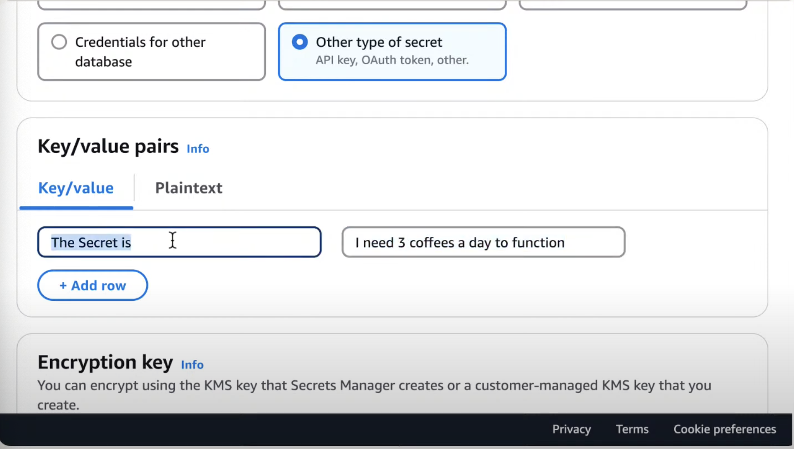
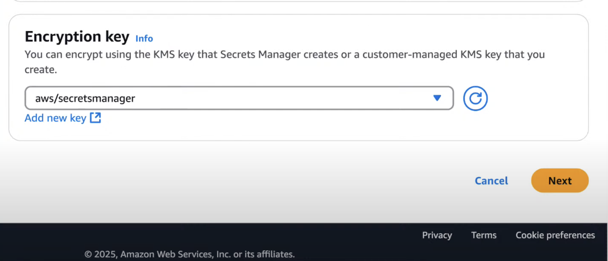
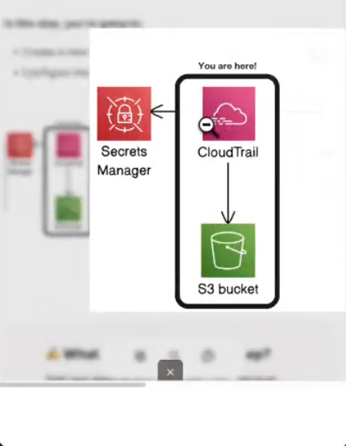
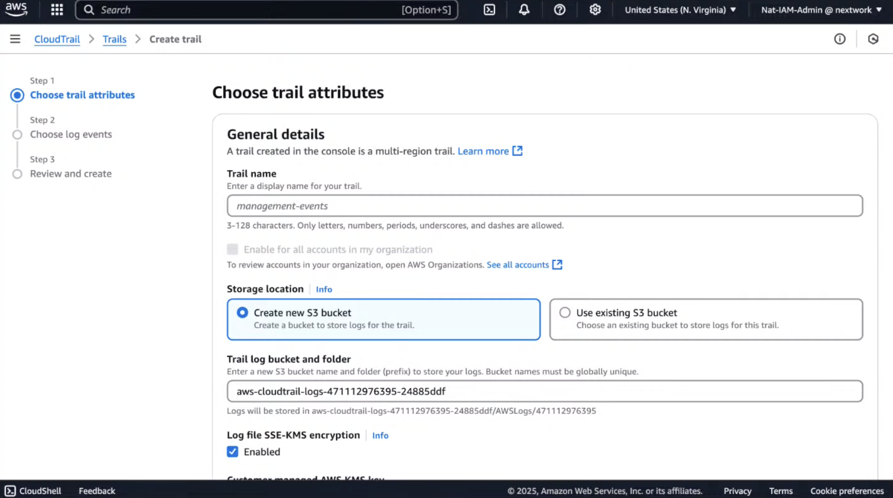
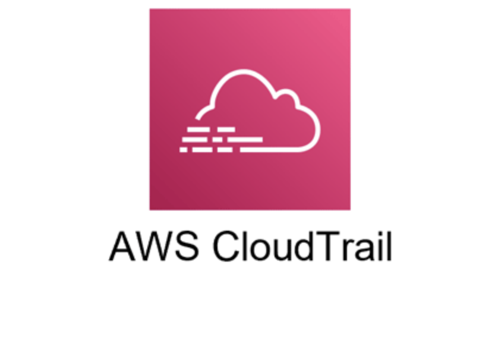
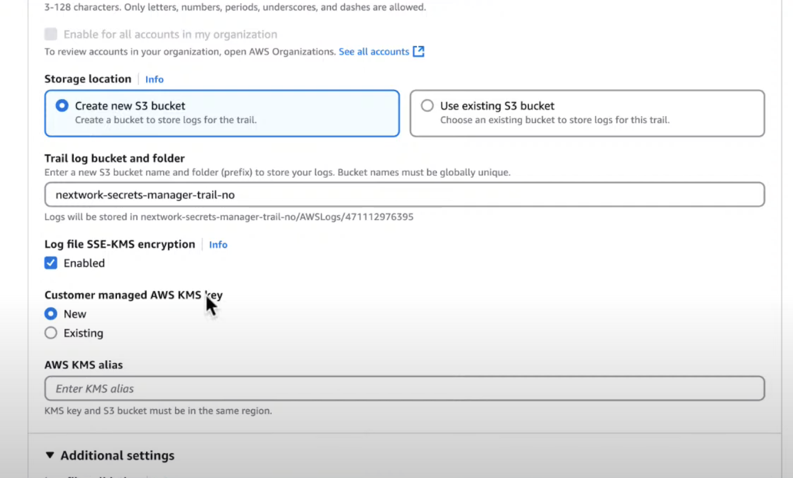

# AWS-Security-Alert

## 📌 To Do
- Build a new security monitoring system  
- Set up alerts for when the security monitoring system is accessed  

## 🛠 Using
- **CloudTrail** – process and analyze events  
- **CloudWatch** – monitoring and log analysis  
- **SNS** – send notifications/alerts  

## 🚀 Steps
1. Set up **Secrets Manager**  
2. Configure **CloudTrail**  
3. Test **CloudTrail**  
4. Configure **CloudWatch**  
5. Set up alert system with **SNS** to receive emails  
6. Test and troubleshoot the entire system  

---

✅ This project demonstrates how AWS native services can be integrated to build a simple but effective **security monitoring and alerting system**. It can be expanded into a foundation for **SIEM-style monitoring** in cloud environments.

## Secrets Manager
In AWS Secrets Manager > Secrets > Store a new secret, I select “Other type of secret.”  
I then entered the Key/Value pairs:  
- **Key:** “The Secret is”  
- **Value:** “I need 3 coffees a day to function.”  

Next, I added an encryption key. AWS encryption keys are important for protecting sensitive data, and permissions can be assigned so only specific people can access the key.  

Another feature I like about Secrets Manager is the ability to replicate secrets across multiple regions for availability.
Secret successfully created.

## Summary
Created a secret called **“TopSecretInfo”** in AWS Secrets Manager containing the string value:

## CloudTrail

Now I’ll configure CloudTrail to detect if someone attempts to access the secret.  
CloudTrail tracks events that happen in an AWS account, logging details about who accessed a resource, when, and how.

**Setting up trails:** When you create a trail, you tell CloudTrail which activities to log and where to store those logs.  

 <!-- Image 5 -->
## CloudTrail Overview

CloudTrail is essential for security, compliance, and troubleshooting, as it allows detection of suspicious activity.

## S3 Bucket for CloudTrail

Created an S3 bucket to store CloudTrail logs for monitoring and analysis.  

