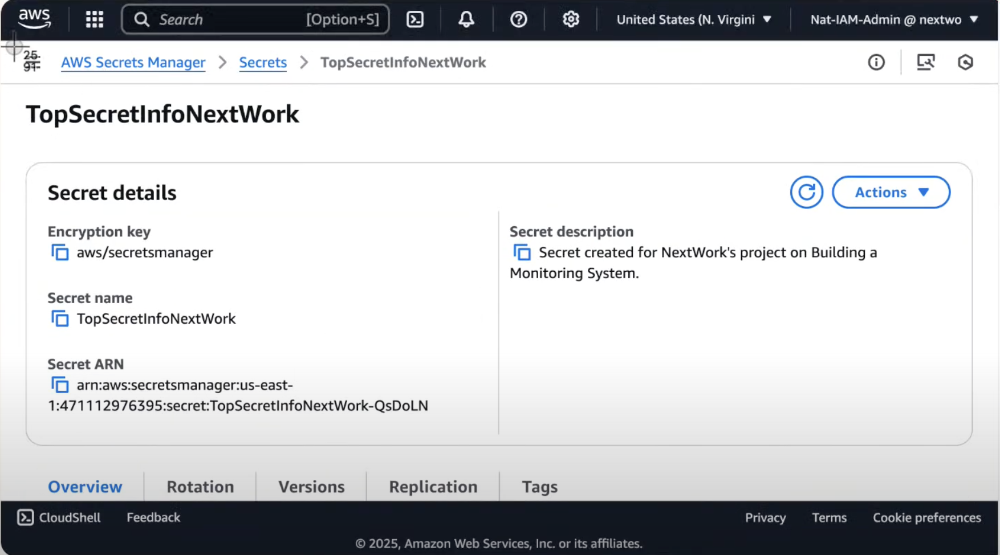
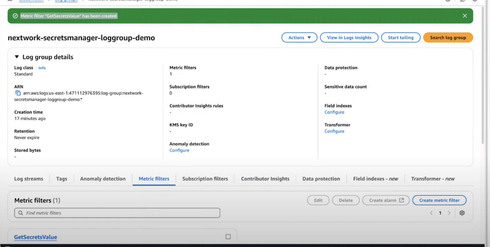

# AWS-Security-Alert

## 📌 To Do
- Build a new security monitoring system  
- Set up alerts for when the security monitoring system is accessed  

## 🛠 Using
- **CloudTrail** – process and analyze events  
- **CloudWatch** – monitoring and log analysis  
- **SNS** – send notifications/alerts  

## 🚀 Steps
1. Set up **Secrets Manager**  
2. Configure **CloudTrail**  
3. Test **CloudTrail**  
4. Configure **CloudWatch**  
5. Set up alert system with **SNS** to receive emails  
6. Test and troubleshoot the entire system  

---

✅ This project demonstrates how AWS native services can be integrated to build a simple but effective **security monitoring and alerting system**. It can be expanded into a foundation for **SIEM-style monitoring** in cloud environments.

## Secrets Manager
In AWS Secrets Manager > Secrets > Store a new secret, I select “Other type of secret.”  
I then entered the Key/Value pairs:  
- **Key:** “The Secret is”  
- **Value:** “I need 3 coffees a day to function.”  

Next, I added an encryption key. AWS encryption keys are important for protecting sensitive data, and permissions can be assigned so only specific people can access the key.  

Another feature I like about Secrets Manager is the ability to replicate secrets across multiple regions for availability.
Secret successfully created.

## Summary
Created a secret called **“TopSecretInfo”** in AWS Secrets Manager containing the string value:

## CloudTrail

Now I’ll configure CloudTrail to detect if someone attempts to access the secret.  
CloudTrail tracks events that happen in an AWS account, logging details about who accessed a resource, when, and how.

**Setting up trails:** When you create a trail, you tell CloudTrail which activities to log and where to store those logs.  

 <!-- Image 5 -->
## CloudTrail Overview

CloudTrail is essential for security, compliance, and troubleshooting, as it allows detection of suspicious activity.

## S3 Bucket for CloudTrail

Created an S3 bucket to store CloudTrail logs for monitoring and analysis.  

### Creating an S3 Bucket
Returned to Secrets Manager to view the secret.  
 <!-- Image 9 -->

### CloudShell Terminal
In CloudShell, I ran the AWS CLI command to retrieve the secret, replacing `your-region-code` with the correct region.  
Output confirmed the secret value:  
“I need 3 coffees a day to function.”  
 <!-- Image 10 -->
### Secret Retrieval Methods
Two retrieval methods:  
1. Secrets Manager Console (Retrieve value button)  
2. AWS CLI (`get-secret-value` command)  
 <!-- Image 11 -->

### Analyzing CloudTrail Events
Checking Event history in CloudTrail showed `GetSecretValue` events for both retrieval methods (console & CLI). This confirms CloudTrail successfully tracks when secrets are accessed.  
 <!-- Image 12 -->

### CloudWatch Setup
Next, I configured CloudWatch for deeper log analysis and to create metrics that track how often a secret is accessed.  
CloudWatch is crucial because:  
- You can create alerts based on logs.  
- Unlike CloudTrail’s 90-day history, CloudWatch logs can be stored indefinitely.  
- Logs can be aggregated and filtered across multiple AWS services.  

(Event History = short-term view, CloudWatch Logs = long-term, detailed analysis.)  
## Creating a Filter Pattern  
 <!-- Image 13 -->
Created a metric filter to track all events where the secret was accessed (GetSecretValue).
